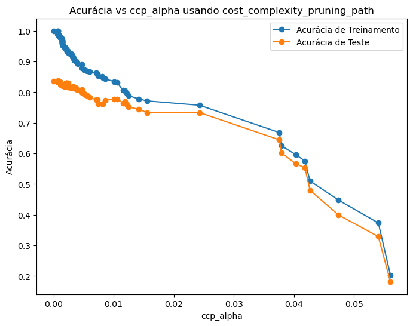

# Introdução às Árvores de Decisão
As árvores de decisão são modelos preditivos que utilizam uma estrutura em forma de árvore para tomar decisões baseadas em regras aprendidas dos dados de treinamento. Cada nó interno representa uma condição em uma variável de entrada, cada ramo representa o resultado da condição, e cada folha representa uma previsão ou resultado.

Apesar de sua simplicidade e interpretabilidade, as árvores de decisão têm a tendência de crescer excessivamente, criando modelos complexos que se ajustam muito bem aos dados de treinamento (*overfitting*), mas apresentam desempenho ruim em dados não vistos.

```python
import numpy as np
import matplotlib.pyplot as plt
from sklearn.datasets import load_iris
from sklearn.tree import DecisionTreeClassifier, plot_tree
from sklearn.model_selection import train_test_split

# Carregar o conjunto de dados Iris
X, y = load_iris(return_X_y=True)

# Dividir os dados em conjuntos de treinamento e teste
X_train, X_test, y_train, y_test = train_test_split(
    X, y, test_size=0.3, random_state=42
)

# Inicializar o classificador de árvore de decisão
clf = DecisionTreeClassifier(random_state=0)

# Treinar o modelo
clf.fit(X_train, y_train)

# Avaliar a acurácia nos conjuntos de treinamento e teste
train_score = clf.score(X_train, y_train)
test_score = clf.score(X_test, y_test)
print(f"Acurácia no treinamento: {train_score:.4f}")
print(f"Acurácia no teste: {test_score:.4f}")
```

# Entendendo o Parâmetro `ccp_alpha`
O parâmetro `ccp_alpha` (*Complexity Parameter Alpha*) é uma ferramenta poderosa para controlar a complexidade das árvores de decisão através da poda de custo-complexidade mínima (*Minimal Cost-Complexity Pruning*). Ele adiciona um custo proporcional ao tamanho da árvore durante o processo de treinamento, penalizando árvores mais complexas.

O `ccp_alpha` é um valor não negativo que penaliza a complexidade da árvore (número de folhas) em relação ao erro de treinamento. Ao ajustar este parâmetro, você equilibra o *trade-off* entre viés e variância.

## Como Funciona o `ccp_alpha`
- **Valores Baixos de `ccp_alpha`**: Permitem árvores mais complexas, com mais nós e folhas. Isso pode levar ao *overfitting*, onde o modelo captura ruídos nos dados de treinamento.
- **Valores Altos de `ccp_alpha`**: Produzem árvores mais simples, com menos nós. Isso pode resultar em *underfitting*, onde o modelo não captura a complexidade inerente aos dados.
O objetivo é encontrar um valor de `ccp_alpha` que equilibre o *trade-off* entre viés e variância, resultando em um modelo que generalize bem para novos dados.

## Por Que Usar ccp_alpha?
- **Controlar Overfitting**: Ao podar ramos irrelevantes ou ruidosos da árvore.
- **Melhorar a Generalização**: Produzindo um modelo que funciona melhor em dados não vistos.

```python
# Definir um valor de ccp_alpha
ccp_alpha = 0.01

# Inicializar o classificador com ccp_alpha
clf_pruned = DecisionTreeClassifier(random_state=0, ccp_alpha=ccp_alpha)

# Treinar o modelo podado
clf_pruned.fit(X_train, y_train)

# Avaliar a acurácia nos conjuntos de treinamento e teste
train_score_pruned = clf_pruned.score(X_train, y_train)
test_score_pruned = clf_pruned.score(X_test, y_test)
print(f"Acurácia no treinamento (podado): {train_score_pruned:.4f}")
print(f"Acurácia no teste (podado): {test_score_pruned:.4f}")
```

# Explicando o `cost_complexity_pruning_path`
O método `cost_complexity_pruning_path` do scikit-learn é utilizado para calcular os valores efetivos de alfa (α) que são utilizados para podar a árvore. Ele fornece um caminho de poda, permitindo identificar os pontos onde a poda causa mudanças significativas na estrutura da árvore.

## Como Funciona o `cost_complexity_pruning_path`
- **Construção da Árvore Completa**: Inicialmente, uma árvore de decisão completa é construída sem restrições de poda.
- **Cálculo dos Valores de `ccp_alpha`**: O método calcula uma série de valores de `ccp_alpha` onde a poda altera a estrutura da árvore.
- **Retorno dos Resultados**: Retorna arrays de `ccp_alphas` e as impurezas correspondentes da árvore.

**Exemplo em Python Usando `cost_complexity_pruning_path`**

```python
# Treinar a árvore completa para obter o caminho de poda
clf = DecisionTreeClassifier(random_state=0)
# Obter os valores de ccp_alpha e as impurezas.
path = clf.cost_complexity_pruning_path(X_train, y_train)
ccp_alphas = path.ccp_alphas
impurities = path.impurities

# Remover o último valor que corresponde à árvore trivial
ccp_alphas = ccp_alphas[:-1]
impurities = impurities[:-1]

# Treinar árvores com diferentes valores de ccp_alpha
clfs = []
for ccp_alpha in ccp_alphas:
    clf = DecisionTreeClassifier(random_state=0, ccp_alpha=ccp_alpha)
    clf.fit(X_train, y_train)
    clfs.append(clf)

# Obter acurácias para cada árvore
train_acc = [clf.score(X_train, y_train) for clf in clfs]
test_acc = [clf.score(X_test, y_test) for clf in clfs]

# Plotar acurácia vs ccp_alpha
plt.figure(figsize=(8, 6))
plt.plot(ccp_alphas, train_acc, marker='o', label='Acurácia de Treinamento')
plt.plot(ccp_alphas, test_acc, marker='o', label='Acurácia de Teste')
plt.xlabel('ccp_alpha')
plt.ylabel('Acurácia')
plt.title('Acurácia vs ccp_alpha usando cost_complexity_pruning_path')
plt.legend()
plt.show()
```
O gráfico resultante mostra como a acurácia varia com diferentes valores de `ccp_alpha`. Podemos identificar o valor ótimo de `ccp_alpha` que equilibra a complexidade da árvore e a capacidade de generalização em treinamento e teste.




# Considerações Computacionais com Grandes Conjuntos de Dados
Ao lidar com conjuntos de dados muito grandes, o cálculo de múltiplos valores de `ccp_alpha` pode ser computacionalmente custoso. Isso ocorre porque:

- **Construção da Árvore Completa**: Pode requerer memória e tempo significativos.
- **Cálculo do Caminho de Poda**: Pode ser intensivo devido ao tamanho da árvore.

## Estratégias para Mitigar o Problema
### Limitar a Complexidade da Árvore Inicial
Defina parâmetros como `max_depth` ou `min_samples_leaf` ao construir a árvore inicial para evitar que ela se torne muito grande.

```python
clf = DecisionTreeClassifier(random_state=0, max_depth=10, min_samples_leaf=5)
clf.fit(X_train, y_train)
```

### Usar um Subconjunto dos Dados
Utilize uma amostra representativa dos dados para calcular o caminho de poda.

```python
from sklearn.model_selection import ShuffleSplit

ss = ShuffleSplit(n_splits=1, train_size=1000, random_state=42)
for small_train_index, _ in ss.split(X_train):
    X_small_train = X_train[small_train_index]
    y_small_train = y_train[small_train_index]
```

### Realizar Busca em Grade com Validação Cruzada
Em vez de calcular todos os valores possíveis de `ccp_alpha`, use GridSearchCV para testar uma faixa de valores.

```python
from sklearn.model_selection import GridSearchCV

param_grid = {'ccp_alpha': np.linspace(0, 0.02, num=21)}
grid_search = GridSearchCV(DecisionTreeClassifier(random_state=0), param_grid, cv=5)
grid_search.fit(X_small_train, y_small_train)

best_ccp_alpha = grid_search.best_params_['ccp_alpha']
print(f"Melhor ccp_alpha: {best_ccp_alpha}")
```

### Utilizar Métodos de Ensemble
Modelos como Random Forest ou Gradient Boosting são mais eficientes em grandes conjuntos de dados.
```python
from sklearn.ensemble import RandomForestClassifier

clf = RandomForestClassifier(n_estimators=100, max_depth=10, random_state=0)
clf.fit(X_train, y_train)
```

# Conclusão
O parâmetro `ccp_alpha` é uma ferramenta essencial para controlar a complexidade de árvores de decisão no scikit-learn. Ele permite podar a árvore de forma a equilibrar a precisão em treinamento e a capacidade de generalização.

Ao lidar com grandes conjuntos de dados, é importante considerar o custo computacional associado ao cálculo do caminho de poda. Estratégias como limitar a complexidade da árvore inicial, usar subconjuntos de dados ou realizar busca em grade podem ajudar a mitigar esses desafios.

Neste artigo, exploramos detalhadamente como usar o `ccp_alpha` e o método `cost_complexity_pruning_path`, fornecendo exemplos práticos em Python com o conjunto de dados Iris. Esperamos que este guia ajude você a construir modelos de árvore de decisão mais eficazes e eficientes.